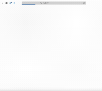

# Tic-Tac-Toe Web App

This is a modern, interactive Tic-Tac-Toe game built with React, TypeScript, and Vite. The app features two types of bot opponents, including one powered by Llama 3.1 8B running locally via Ollama for both move selection and playful, cheeky commentary.

Demo (takes a few seconds to load):



## 🎮 Main Features

- **Play Tic-Tac-Toe in your browser**: Enjoy a classic game with a beautiful, responsive interface.
- **Choose your side**: Play as X or O.
- **Play against two types of bots**:
  - **Simple Bot**: Makes smart but not perfect moves.
  - **Ollama Bot**: Uses Llama 3.1 8B running locally via Ollama to decide its moves and comment on the game with cheeky, playful messages.
- **Bot Chat**: See the bot's comments in a chat bubble next to the game board for a more interactive experience.
- **Winning Highlight**: Only the winning line is highlighted when someone wins.
- **Restart and Side Switch**: Easily restart the game or switch sides at any time.

## 🛠️ Technologies Used

- **React**: For building the user interface.
- **TypeScript**: For type safety and better code quality.
- **Vite**: For fast development and build tooling.
- **Ollama**: For running Llama 3.1 8B locally to power the AI bot with strategic moves and fun commentary.

## 🚀 How to Run

1. **Clone the repository** and install dependencies:
   ```sh
   npm install
   ```
2. **Install and run Ollama** with Llama 3.1:
   ```sh
   # Install Ollama (if not already installed)
   # Visit https://ollama.ai for installation instructions
   
   # Pull the Llama 3.1 model
   ollama pull llama3.1
   
   # Start Ollama (runs on http://localhost:11434)
   ollama serve
   ```
3. **Start the development server:**
   ```sh
   npm run dev
   ```
4. **Open your browser** to the local address shown in the terminal (usually http://localhost:5173).

## 📹 Demo


(Takes a few seconds to load)

## ✨ Why This Project?

This project demonstrates:
- Building modern, user-friendly web apps
- Integrating local AI models (Llama 3.1 8B) via Ollama
- Creating interactive, engaging user experiences
- Writing clean, maintainable code with React and TypeScript

---

Thank you for checking out this Tic-Tac-Toe project! If you have any questions or feedback, feel free to reach out.
